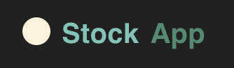
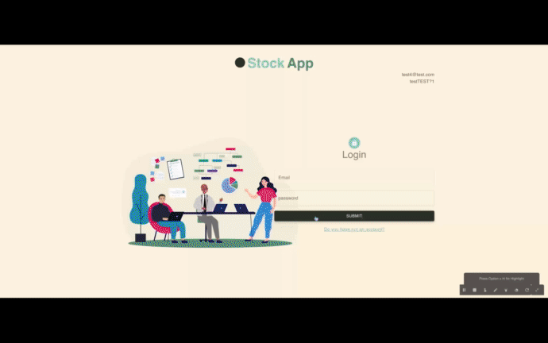

<a name="readme-top"></a>
 
 
<!-- PROJECT LOGO -->
<br />
<div align="center">
   
  <a href="https://github.com/ibrsec/stockapp-fullstack-render">
    
  </a>

  <h3 align="center">Full stack Stock App</h3>

  <p align="center">
    An awesome Full-stack Stock App
    <!-- <a href="https://github.com/ibrsec/stock-app"><strong>Explore the docs »</strong></a> -->
    <br />
    <br />
    <a href="https://stockapp-fullstack-render.onrender.com/">View Demo</a>
    ·
    <a href="https://github.com/ibrsec/stockapp-fullstack-render/tree/main/client">Frontend Repo</a>
    ·
    <a href="https://github.com/ibrsec/stockapp-fullstack-render/api/v1/documents/swagger">Backend Swagger</a>
    ·
    <a href="https://github.com/ibrsec/stockapp-fullstack-render/issues">Report Bug</a>
    ·
    <a href="https://github.com/ibrsec/stockapp-fullstack-render/issues">Request Feature</a>
  </p>
</div>


<!-- TABLE OF CONTENTS -->
<details>
  <summary>📎 Table of Contents 📎 </summary>
  <ol>
    <li><a href="#about-the-project">About The Project</a></li>
     <!-- <li><a href="#figma">Figma</a></li> -->
     <li><a href="#overview">Overview</a></li>
     <li><a href="#quick-setup">Quick Setup</a></li>
     <li><a href="#directory-structure">Directory structure</a></li>
     <li><a href="#built-with">Built With</a></li>
    <!-- <li>
      <a href="#getting-started">Getting Started</a>
      <ul>
        <li><a href="#prerequisites">Prerequisites</a></li>
        <li><a href="#installation">Installation</a></li>
      </ul>
    </li>
    <li><a href="#usage">Usage</a></li>
    <li><a href="#roadmap">Roadmap</a></li>
    <li><a href="#contributing">Contributing</a></li>
    <li><a href="#license">License</a></li>
    <li><a href="#contact">Contact</a></li>
    <li><a href="#acknowledgments">Acknowledgments</a></li> -->

    
  </ol>
</details>


---

<!-- ABOUT THE PROJECT -->
<a name="about-the-project"></a>
## ℹ️ About The Project

[](https://stockapp-fullstack-render.onrender.com/)
---
<b>ERD:</b>
[](https://stockapp-fullstack-render.onrender.com/)


<p align="right">(<a href="#readme-top">back to top</a>)</p>


---

<!-- ## Figma 

<a href="https://www.figma.com/file/ePyCHKsx2ODB32uLgyUEEd/bootstrap-home-page?type=design&node-id=0%3A1&mode=design&t=edDzadCB9Ev5FS1a-1">Figma Link</a>  

  <p align="right">(<a href="#readme-top">back to top</a>)</p>


--- -->
<a name="overview"></a>
## 👀 Overview

📦 A Fullstack Stock App Project</br>
🏀 [Frontend Live](https://github.com/ibrsec/stockapp-fullstack-render) || [Backend Swagger](https://github.com/ibrsec/stockapp-fullstack-render/api/v1/documents/swagger) || [Backend Redoc](https://github.com/ibrsec/stockapp-fullstack-render/api/v1/documents/redoc)</br>
FRONTEND:</br>
🎯 <b>React Development:</b> Built a responsive frontend with React.js, delivering a seamless user experience.</br>

🛠 <b>State Management:</b> Utilized Redux Toolkit and Persist for consistent state management across sessions.</br>

🚀 <b>React Router:</b> Integrated React Router for smooth navigation between key sections like dashboard, products, and sales.</br>

📊 <b>UI Components:</b> Employed Material UI's DataGrid and Charts for interactive tables and data visualizations.</br>

📝 <b>Form Validation:</b> Managed forms with Formik and Yup for accurate data input and validation.</br>

🔔 <b>User Notifications:</b> Added real-time feedback using Toastify for actions like adding or editing records.</br>

💾 <b>CRUD Operations:</b> Implemented full CRUD functionality for products, sales, firms, and more.</br>

🃏 <b>Card Layouts:</b> Designed intuitive card-based interfaces for managing firms and brands.</br>

📊 <b>Data Tables:</b> Organized stock information in editable tables for easy data management.
</br>
BACKEND:</br>
<b>🎯 Express.js Framework:</b> Developed a robust RESTful API with Express.js for secure and efficient stock data management.

<b>🔒 Authentication & Authorization:</b> Implemented Simple Token, JWT for secure user authentication.

<b>📄 API Documentation:</b> Created clear API docs with Swagger and Redoc for easy testing and understanding.

<b>📊 Database Management:</b> Utilized MongoDB and Mongoose for consistent data modeling and querying.

<b>🔄 CRUD Operations:</b> Built full CRUD functionality for products, sales, purchases, firms, and brands.

<b>🛠 Middleware & Error Handling:</b> Added custom middleware for validation and consistent error handling.

<b>🌐 Scalable Deployment:</b> Deployed on scalable platforms like Netlify and Vercel for high availability.


<p align="right">(<a href="#readme-top">back to top</a>)</p>


<a name="quick-setup"></a>
## 🛫 Quick Setup

```sh
# clone the project
git clone https://github.com/ibrsec/stockapp-fullstack-render.git

# enter the project directory
cd stockapp-fullstack-render

# install dependency
# linux
npm run setup-production
# windows
npm run setup-production-windows

# run
node index.js

```

<p align="right">(<a href="#readme-top">back to top</a>)</p>


<!-- ## 🐞 Debug

 -->


<a name="directory-structure"></a>
## 📂 Directory structure 

```diff
+ personnel_app-backend  (folder)  
      |---client (folder)   
      |      |          
      |      |---public (folder) 
      |      |                
+     |      |---src (folder) 
      |      |     |---assests (folder) 
      |      |     |           
      |      |     |---pages (folder)       
      |      |     |           
      |      |     |---components (folder) 
      |      |     |    
      |      |     |---app (folder) ---store.jsx      
      |      |     |          
      |      |     |---features (folder)       
      |      |     |     |---authSlice.jsx  
      |      |     |     └---stockSlice.jsx       
      |      |     |          
      |      |     |---router (folder)         
      |      |     |          
      |      |     |---services (folder)              
      |      |     |          
      |      |     |---helper (folder)          
      |      |     |          
      |      |     |---App.js 
      |      |     |---Index.js
      |      |     └---Index.css
      |      |      
      |      |----package.json
      |      |----yarn.lock
      |      |----tailwind.config.js 
      |      └----readme.md 
      |      
+     |---src (folder) 
      |     |---config (folder)       
      |     |           
      |     |---controllers (folder) 
      |     |    
      |     |---errors (folder) 
      |     |    
      |     |---helpers (folder)      
      |     |          
      |     |---middlewares (folder)      
      |     |          
      |     |---models (folder)           
      |     |          
      |     └---routes (folder)  
      |      
      |----.env
      |----.gitignore
      |----index.js
      |----package-lock.json
      |----package.json
      |----swaggerAutogen.js
      └----readme.md 
```

<p align="right">(<a href="#readme-top">back to top</a>)</p>

---

<a name="built-with"></a>
### 🏗️ Built With
<b>Frontend</b>
 
<!-- https://dev.to/envoy_/150-badges-for-github-pnk  search skills-->

 
  
  
 <!--   -->
 <!--   -->
 <!--   -->
  
  

  
  
  
 <!--   -->


  
 <!--   -->

  
  
  
  
 


---

<b>Backend</b>
<!-- https://dev.to/envoy_/150-badges-for-github-pnk  search skills-->

 <!--  -->
 <!--   -->
  
 <!--   -->
 <!--   -->
 <!--   -->
 <!--   -->
 <!--   -->
 <!--   -->
 <!--   -->

  <!--    -->
 <!--   -->
 <!--   -->
 <!--   -->


 <!--   -->

 <!--   -->

 <!--   -->
 <!--   -->
 <!--   -->
 <!--   -->
 <!--   -->
  
  
  
  
 <!--   -->
  

<!-- swagger -->
  
  
  


  
  
  
  
 

  


 
<p align="right">(<a href="#readme-top">back to top</a>)</p>


